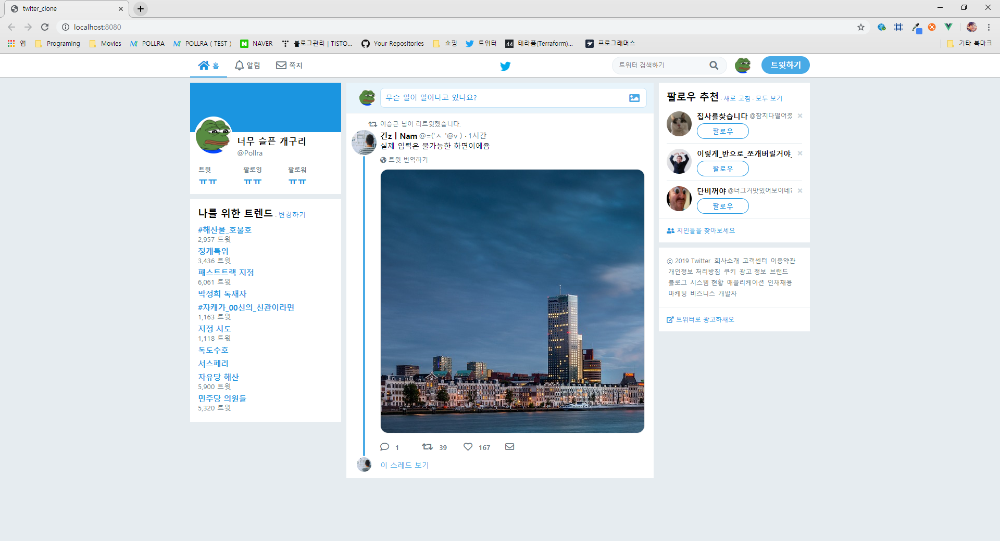
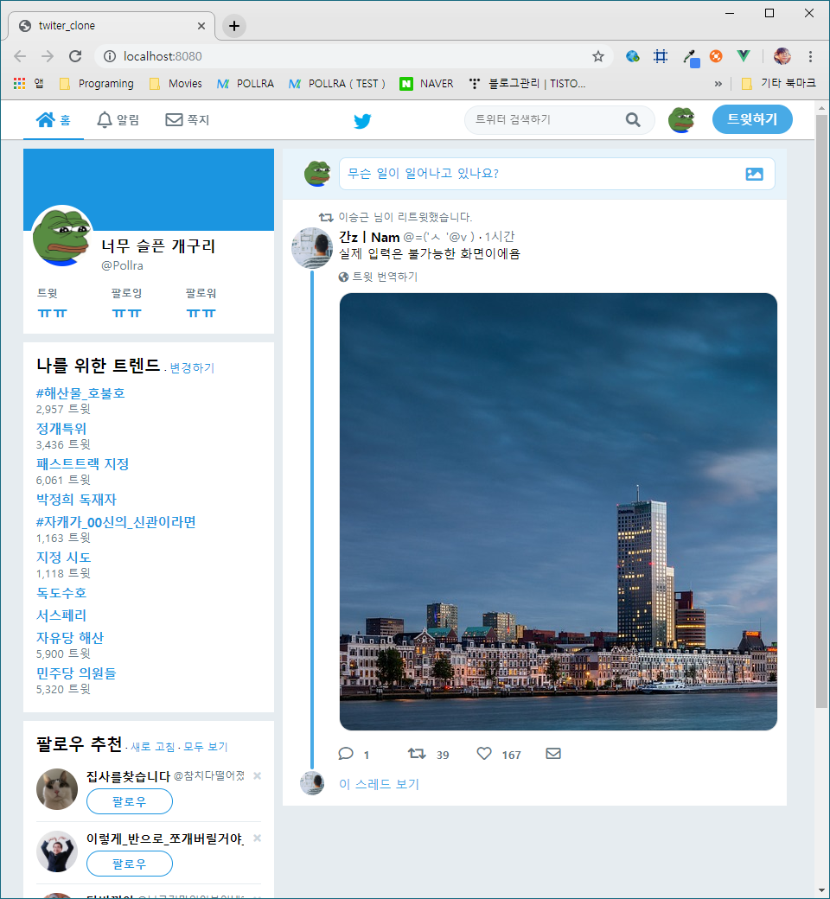

# 트위터 클론
트위터의 UI를 따라서 만들었습니다.
 
```Atomic Design``` 적용.


전체화면일때 UI 모습입니다.



화면을 반으로 줄였을때의 모습입니다.


# twiter_clone

> A Vue.js project

## Build Setup

``` bash
# install dependencies
npm install

# serve with hot reload at localhost:8080
npm run dev

# build for production with minification
npm run build
```

For detailed explanation on how things work, consult the [docs for vue-loader](http://vuejs.github.io/vue-loader).
"# twiter_clone" 
